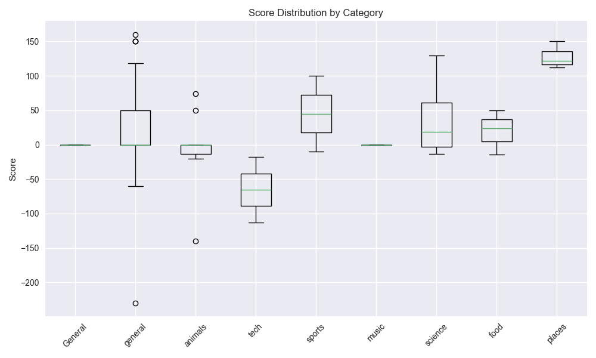

# WizWord 🎯

WizWord is an AI-powered word guessing game where players try to guess a hidden word by asking yes/no questions. The game uses advanced AI models to select words and answer questions intelligently.

## Features

- Multiple difficulty levels and word categories (now supports alphanumeric titles like "Se7en", "Rio2", "Sing2")
- AI-powered word selection and question answering
- Fun and Challenge modes with strategic scoring system
- Optional nickname-based leaderboard
- Local and cloud storage support
- Mobile and desktop friendly UI
- New: Category Top SEI achievements with email + share card + in‑app celebration
- Registration with password confirmation
- Guest demo mode (Try as Guest) — no data is written to user files

## Setup

1. Clone the repository:
```bash
git clone https://github.com/yourusername/wizword.git
cd wizword
```

2. Create and activate a virtual environment:
```bash
python -m venv venv
source venv/bin/activate  # On Windows: venv\Scripts\activate
```

3. Install dependencies:
```bash
pip install -r requirements.txt
```

4. Create a `.env` file in the project root:
```env
# OpenRouter API Configuration
OPENROUTER_API_KEY=your_api_key_here

# AWS Configuration (Optional - for cloud storage)
AWS_ACCESS_KEY_ID=your_aws_access_key_id
AWS_SECRET_ACCESS_KEY=your_aws_secret_access_key
AWS_REGION=your_aws_region  # e.g., us-east-1

# Game Configuration
USE_CLOUD_STORAGE=false  # Set to true to use AWS DynamoDB instead of local storage

# SMTP for achievement emails
SMTP_HOST=smtp.example.com
SMTP_PORT=587
SMTP_USER=bot@example.com
SMTP_PASS=app_password
ADMIN_EMAIL=admin@example.com  # optional; falls back to SMTP_USER if not set

# Feature flags
# Controls visibility and usage of the profile‑aware Personal category
ENABLE_PERSONAL_CATEGORY=true  # set false to hide Personal and force General instead
```

5. Run the game:
```bash
streamlit run streamlit_app.py
```

### Optional: run the document‑hint backend (for FlashCard uploads)
The FastAPI service parses PDF/DOCX/TXT and asks the LLM for grounded hints.

```bash
# New terminal, from project root
export PYTHONPATH="$PWD"            # PowerShell: $env:PYTHONPATH="$PWD"
python -m uvicorn wizword.backend.doc_api:app --host 127.0.0.1 --port 8000
```
The UI calls the backend at `BACKEND_HINTS_URL` (default `http://localhost:8000/generate-hints`).

Backend .env precedence and debugging:
- The backend loads `.env` from the project root and `.env` values OVERRIDE any pre-set environment variables for deterministic config.
- Verify effective config via the debug endpoint:
  - PowerShell: `curl http://127.0.0.1:8000/env-debug`
  - Returns: `env_path`, selected env values, and computed limits (e.g., `flashcard_pool_max`).
  - If values are unexpected, check for duplicate lines in `.env` or persistent User/Machine env vars and clear them.

## How to Play

- Choose a mode:
  - Fun: No timer, unlimited practice
  - Wiz: Track stats and leaderboards
  - Beat: Timed sprint — default {int(os.getenv('BEAT_MODE_TIME', 300)) if False else 300}s
- Pick a category or any for random
- Interact during play:
- FlashCard Settings quick guide:
  - Import by Token at the top; then select sets from the drop‑down.
  - Use Set next to Delete Set switches instantly to the selected set.
  - To create a new set, scroll to Build From Document, enter New Set Name, and click Create/Use. Then you can upload a file and Generate from Document.
  - Your group’s FlashCard leaderboards are filtered by the active token; the token is shown in the header.
  - Ask yes/no questions (−1)
  - Request up to 3 hints (−10 each)
  - Guess any time (wrong −10, correct +20 × word length)
  - Skip word (−10) reveals the word then continues
- SEI (Scoring Efficiency Index) measures efficiency; used in leaderboards/achievements.

### Personal Category (profile‑aware)
If enabled (see ENABLE_PERSONAL_CATEGORY), Personal uses your profile (Bio, Occupation, Education, Address) to request personally relevant words and tailored hints. The UI may briefly show “Generating personal hints…” until 3+ hints are ready; a Retry button appears if needed.

### FlashCard Category (your text)
- Add your own text in Profile → FlashCard Text. The game extracts meaningful words (stopwords excluded) and generates one concise hint per word.
- API‑first for hint generation with local fallback; generated hints are saved into your `flash_pool` and reused.
- The pool auto‑regenerates when you change and save the FlashCard text. Pool size is independent from Personal via `FLASHCARD_POOL_MAX` (or `FLASHCARD_WORDS_COUNT`).

## Screenshots

Gameplay statistics and share card examples:





### UI Walkthrough

- Account Options (Login)

  Place a screenshot at `assets/ui/account_options.png` and it will render here:

  

- How to Play (Login)

  Place a screenshot at `assets/ui/how_to_play.png` and it will render here:

  

Tip: In Streamlit, you can capture screenshots via your OS or a browser extension. Save them into `assets/ui/` to keep the repo organized.

## Authentication & Guest Demo
- Account Options on Login: Delete Account (enter username, email, password, type DELETE) or Reactivate (paste emailed token). The token field is hidden and cleared for safety.

- Registration requires: username, valid email, birthday, education, password, and password confirmation.
- The username 'guest' is reserved for demo access and cannot be registered.
- Login page includes a "Try as Guest" button to explore the app without creating an account.
  - In guest mode, the app avoids writing to user data files (e.g., `users.json`, `users_bio.json`, `game_results.json`).
  - Use this for safe demos without leaving any persistent user data.

- When you choose **Personal**, the game uses your profile (Bio + Occupation + Education + Address) from `users_bio.json` / `users.json` to request personally relevant words and hints.
- If API calls fail or are disabled, Personal falls back to a deterministic offline generator that samples from your Bio with allow/deny lists and relevance scoring.
- With `BYPASS_API_WORD_SELECTION=true`, all other categories use the local dictionary; Personal still attempts the API and falls back offline as needed.
- Hint experience for Personal:
  - Personal words show only 1 hint per word.
  - If a contextual hint isn’t available, a helpful fallback like “Starts with ‘X’” is used.
  - The UI blocks with “Generating personal hints…” and retries until at least 3 hints exist for the current non‑Personal words (general hint system). If it can’t, a warning and a Retry button are shown.

Note on admin control:
- You can disable the Personal category across the app by setting `ENABLE_PERSONAL_CATEGORY=false` in `.env` and restarting the app.
- When disabled:
  - “Personal” is removed from category pickers.
  - Any existing or default “Personal” category is normalized to `general` at runtime.
  - The “How to Play” sections hide the Personal subsection.
  - Accepted values: `true/1/yes/on` to enable, `false/0/no/off` to disable.


1. Configure your game:
   - Choose word length (3-15 letters)
   - Select a category (General, Animals, Food, Personal, etc.)
   - Pick game mode (Fun or Challenge)
   - Enter an optional nickname

2. Game Modes:
   
   ### Fun Mode
   - No scoring system
   - Ask unlimited questions
   - Make multiple guesses
   - Perfect for learning and practice

   ### Challenge/Beat Mode
   - Strategic scoring system:
     - Each question: -1 point (Beat), -5/-10/-15 depending on difficulty (Wiz)
     - Wrong guess: -10 (Beat/Wiz)
     - Correct guess: 100 points per word (fixed)
     - Show Word: -100 points
   - Higher scores are better!
   - Be strategic with your questions to minimize penalties
   - Category notes: Movies/Music/Aviation may include titles/terms with digits (e.g., "Se7en", "Rio2").

3. Asking Questions:
   - Questions must be yes/no format (start with Is, Are, Does, etc.)
   - Questions must end with a question mark
   - Examples:
     - "Is it a type of food?"
     - "Does it contain the letter 'a'?"
     - "Is it something you can find at home?"
     - "Would you use this daily?"

4. Making Guesses:
    - Type your guess when ready
    - Guesses must match the chosen word length
    - Alphanumeric names are allowed (e.g., Se7en, Rio2, Sing2). Only letters count for vowel/uniqueness checks.
    - In Beat mode:
      - Wrong guesses cost 10 points
      - Correct guesses always earn 100 points per word

### New Hint Experience (Mobile‑friendly)

- Single, colorful hint card replaces the old two buttons.
- The card displays the latest hint text in a large, high‑contrast banner.
- Click/tap the hint card to request the next hint.
- First hint each round is shown automatically for free (no penalty).
- Up to two additional hints are available per word with the same penalty (‑10 points each).
- Designed for phones: fluid text sizing and proper wrapping prevent truncation; the card uses full width and breaks long lines gracefully.

Implementation notes (for developers):
- The visual card is rendered as a gradient banner; a full‑size overlay button captures clicks while keeping the visual intact.
- Styles use CSS clamp() and wrapping rules (overflow‑wrap/word‑break/white‑space) to ensure readability on small screens.

## Score Efficiency Index (SEI)
SEI is a performance metric that combines your average score per word and your average time per word:

    SEI = (Average Score per Word) / (Average Time per Word in seconds)

- A higher SEI means you are both fast and accurate.
- The global leaderboard ranks users by their highest SEI in any single game.
- SEI is shown on your share card and in your statistics graphs.

### New: Top SEI Achievements
When you achieve the highest SEI in a category (or tie the high with a non-zero SEI):
- A dedicated “Congratulations” share card is generated and emailed to you (CC admin):
  - CCs the address from ADMIN_EMAIL (fallback: SMTP_USER if ADMIN_EMAIL is unset).
  - Title: Congratulations!
  - Subtitle: Global Top SEI — Category: <your category>
  - UTC timestamp
  - Your SEI value highlighted
  - Trophy artwork with "WizWord" in the cup, your username on the top base tier, and the category on the bottom base tier
- A celebration appears in-app on the Game Over screen:
  - A trophy emoji flies up
  - A rising congratulations banner and floating balloons briefly show, then auto-dismiss

To test the animation without hitting top SEI, you can temporarily set:
```env
DEBUG_FORCE_TROPHY=true
```
(Do not use in production.)

## Favorite Category

Your **Favorite Category** is the word category (such as Tech, Brands, Science, etc.) in which you have played the most games. The app tracks all your games and determines which category you play most frequently.

## Game Statistics & Performance Graphs

- Running average Score/Word and Time/Word per game
- Separate SEI trend per game
- Leaderboard filtered to the active category

## Recent Words and Repeat Prevention

- Storage: Kept in-memory inside the `WordSelector` singleton. Not written to disk.
- Scope: Tracked per user and per user+subject to avoid immediate repeats.
- FlashCard token scoping: For FlashCard, recents are tracked per user + FlashCard + active token (or set name if no token). This prevents repeats bleeding across different shared sets.
- Capacity: Controlled by env `RECENT_WORDS_LIMIT` (default 50).
- Persistence: Persists across logout (same server process), resets on server restart or when cleared explicitly.
- Updates:
  - Added on correct guess
  - Not added on Skip or Show Word (so skips/reveals do not block future selection)

Debugging (optional, temporary)

Add this snippet to `streamlit_app.py` near the gameplay area to inspect the combo list and last word:

```python
# DEBUG: verify recents for current user+subject
with st.expander("Debug: Recent words (per user+subject)", expanded=False):
    try:
        ws = st.session_state.game.word_selector
        uname = (st.session_state.get('user') or {}).get('username', 'global')
        subj = getattr(st.session_state.game, 'subject', 'general')
        key = f"{uname}:{subj}"
        st.write("recent combo list:", getattr(ws, "_recently_used_words_by_combo", {}).get(key, []))
        st.write("last word for combo:", getattr(ws, "_last_word_by_combo", {}).get(key))
    except Exception as e:
        st.write("debug error:", e)
```

Verification steps

1. Start a game and note the current word W.
2. Press Skip and then open the expander:
   - W should not be listed in the recent combo list
   - The last-word entry should be unchanged (not set to W)
3. Solve a word correctly (G) and open the expander again:
   - G appears at the head of the list
   - Last-word updates to G

## Aggregates and Performance

To avoid rescanning `game_results.json` on every render, the app maintains a compact aggregates store:

- Location: `game_data/aggregates.json` (override with `AGGREGATES_PATH`)
- Bootstrap: On first run, if the file is missing/empty, it auto-imports all existing games from `GAME_RESULTS_PATH` and builds aggregates
- Incremental updates: On each Game Over, new results are appended to the aggregates
- Consumers: Leaderboards, SEI tables, and stats line graphs read from the aggregates for O(Top N) reads

Environment variables:
- `GAME_RESULTS_PATH` (default: `game_results.json`) — full games log (append-only)
- `AGGREGATES_PATH` (default: `game_data/aggregates.json`) — derived data for fast UI queries

Docker/AWS paths (WORKDIR=/app):
- `/app/game_data/aggregates.json` (mount this directory for persistence)

Maintenance:
- To rebuild from scratch, delete the aggregates file and restart; it will bootstrap from `GAME_RESULTS_PATH` on next run

## Cloud Deployment

To enable cloud storage with AWS:

1. Create a DynamoDB table named `word_guess_games` with primary key `session_id`
2. Set up AWS credentials in your `.env` file
3. Set `USE_CLOUD_STORAGE=true` in your `.env` file

## Development

The project structure is organized as follows:

```
word_guess_contest_ai/
│
├── streamlit_app.py                  # Main UI interface
├── backend/
│   ├── game_logic.py                 # Game state and scoring
│   ├── word_selector.py              # AI word selection
│   └── session_manager.py            # Session handling
│
├── assets/                           # Static assets
├── game_data/                        # Local storage (if used)
├── requirements.txt                  # Dependencies
└── README.md                         # This file
```

## Personal Pool (Bio‑only)

- Storage: `users_bio.json` (see Data Files). The file is auto‑created on first access if missing.
- Source: Tokens from the user’s Bio, Occupation, Education, and Address are considered for pool selection.
- Size and top‑ups:
  - Target size is configurable via `.env` (`PERSONAL_POOL_MAX`, default 60).
  - When entering Personal, the app auto‑tops up in batches until the pool reaches the target size, avoiding duplicates.
  - Batch size and API attempt limits are configurable.
- API vs Offline:
  - API is attempted first (unless no/invalid key), with robust JSON repair.
  - If API returns fewer than requested items, partial results are kept and only the remainder is requested on subsequent retries.
  - If still short, the offline generator fills the remainder.
- Biasing and filtering:
  - Deny‑lists remove generic tokens (e.g., “have”, “since”, numbers, common verbs like “watch”).
  - Name‑to‑role mapping requires proper capitalization in Bio (e.g., “Zina”).
  - Location terms from the Bio (e.g., “San Jose”, “Almaden”) map to “Related to where you live.”
- Hints:
  - Contextual one‑liners are generated from Bio; otherwise fallback to first‑letter hints.
  - Generic “Related to your profile” hints are avoided and cleaned via a migration.

### Personal Hint Generation & Persistence

- First build and profile‑save behavior:
  - When your Bio (or related profile fields) changes and you save, the app rebuilds your Personal pool up to `PERSONAL_POOL_MAX`.
  - It requests items via API first within a short time budget; if the API returns fewer than requested, the remainder is filled offline so the pool is usable immediately.
  - Existing API hints for matching words are reused to avoid unnecessary calls when your Bio changes.
- Background upgrades (session‑independent):
  - A background worker periodically reattempts API generation for Personal pool items that still use local hints, one attempt per pass, limited per user by `PERSONAL_WORKER_BATCH_PER_USER` and per word by `PERSONAL_POOL_API_ATTEMPTS`.
  - Successful API hints overwrite local hints and are saved to `users_bio.json`.
  - Respects API quota warnings and pauses under critical quota.
- Data fields in `personal_pool` items:
  - `word`: the selected word
  - `hint`: latest hint text
  - `hint_source`: `api` or `local`
  - `api_attempts`: number of API tries so far (capped by `PERSONAL_POOL_API_ATTEMPTS`)

### Environment Variables (Personal Pool)

Add these to `.env` as needed:

```env
# Personal pool knobs
PERSONAL_POOL_MAX=60              # Max items per user pool
PERSONAL_POOL_BATCH_SIZE=10       # Items requested per top‑up
PERSONAL_POOL_API_ATTEMPTS=3      # Consecutive API retries per top‑up
PERSONAL_POOL_REBUILD_MAX_SECS=8  # Time budget for API-assisted rebuilds
PERSONAL_WORKER_BATCH_PER_USER=3  # Background upgrades per user per pass

# Enable/disable Personal in UI and logic
ENABLE_PERSONAL_CATEGORY=true

# Optional: bypass API for non‑Personal categories
BYPASS_API_WORD_SELECTION=true

# Paths
USERS_BIO_FILE=users_bio.json
```

## FlashCard Category (profile‑provided text)

- Purpose: Create a study/focus deck from your own text. You paste text in your profile, and the system extracts meaningful words and generates one concise hint per word.
- Input Field: “FlashCard Text” in Profile.
- Pool behavior:
  - Pool is built from your FlashCard text and auto‑regenerates when the text changes and you save your profile.
  - Hints are API‑first (if enabled); if API fails, falls back to locally generated hints. API‑generated hints are saved back to your `flash_pool` in `users_bio.json`.
  - Only one hint per word (same as Personal).
  - Stopwords (e.g., “the”, “been”) are excluded.
- API bypass parity: Even if `BYPASS_API_WORD_SELECTION=true`, FlashCard behaves like Personal — allowed to call the API for hints/selection while other categories use local dictionary.
- Pool sizing:
  - Controlled independently from Personal via `FLASHCARD_POOL_MAX` (preferred) or `FLASHCARD_WORDS_COUNT`.
  - Personal continues to use `PERSONAL_POOL_MAX`.
- Regeneration UX: On profile save with changed FlashCard text, the UI shows a progress spinner and a success message when generation completes.

#### FlashCard document uploads
- Upload PDF/DOCX/TXT in FlashCard Settings to build the pool from the file’s text.
- The backend enforces size via `UPLOAD_MAX_BYTES` (default 10240 = 10KB). Increase if your files are larger.
- On success, the UI shows item count and the FlashCard token. If SMTP is configured, the token is emailed to you with the uploaded file attached. The email subject includes the set name, and the body lists the source file name.

#### Managing FlashCard sets (Create, Use, Delete)

- Import by Token (top of panel): paste a token shared by someone and click Import. The input clears automatically after a successful import.
- Active FlashCard Set drop‑down: pick any of your sets.
  - Delete Set: removes the selected set. If it’s an owned set, any imported references in other users are removed automatically (cascading deletion). If it’s an import, only the reference is removed.
  - Use Set: switches to the selected set without altering its content.
- Build From Document block:
  - New Set Name + Create/Use: creates a new set with that name and makes it active. The name field clears after creation.
  - Upload a file (PDF/DOCX/TXT) and click Generate from Document to populate the pool for the active set. The token is ensured and, if SMTP is set, a token email is sent with the document attached.

### FlashCard Hint Generation & Persistence

- First build and profile‑save behavior:
  - Extract candidate words from your FlashCard text (stopwords removed).
  - Make one API attempt per word, then immediately save the pool. Any misses get a local contextual hint so the pool is usable right away.
  - When FlashCard text changes, previously generated API hints for matching words are reused to avoid unnecessary API calls.
- Background upgrades (session‑independent):
  - A background worker periodically reattempts API generation for words that still have local hints, one attempt per pass, limited per user (`FLASHCARD_WORKER_BATCH_PER_USER`) and per word (`PERSONAL_POOL_API_ATTEMPTS`).
  - Successful API hints overwrite local hints and are saved to `flash_pool`.
  - Honors API quota warnings and pauses under critical quota.
- Data fields in `flash_pool` items:
  - `word`: the selected word
  - `hint`: latest hint text
  - `hint_source`: `api` or `local`
  - `api_attempts`: number of API tries so far (capped by `PERSONAL_POOL_API_ATTEMPTS`)

#### Sharing, Importing, and Deletion (Tokens)

- Each FlashCard set has a short token that can be shared with others. Imports reference the owner’s set by token (no copying), so everyone stays in sync.
- Email: After saving a set or generating from a document, the token is shown in‑app and can be emailed to the set owner (if SMTP is configured). The From/CC behavior uses `SMTP_USER`/`ADMIN_EMAIL` as documented above.
- Email details: Subject is “Your WizWord FlashCard set token — <Set Name>”. When generated from a document, the uploaded file is attached and the body includes the source file name.
- Leaderboard scoping: The FlashCard Top 3 on pre‑game and game‑over screens is filtered by the active set’s token so you only see your token group.
- Cascading deletion (new): When an owner deletes a FlashCard set, all imported references to that set (by token) are automatically removed from other users in `users.flashcards.json`. The share entry is also removed from `game_data/flash_shares.json` when present. If a user’s active set was that import, their `flash_active_set` is reset to another available set (or empty).

### Environment Variables (FlashCard)

```env
# FlashCard text limits
FLASHCARD_TEXT_MAX=2000            # Max characters allowed in FlashCard Text input

# FlashCard pool size (independent of Personal)
FLASHCARD_POOL_MAX=60              # Preferred; controls flash_pool target size
# Backward‑compat: used if FLASHCARD_POOL_MAX is unset
FLASHCARD_WORDS_COUNT=60

# Reuse Personal knobs for generation cadence
PERSONAL_POOL_BATCH_SIZE=10        # Batch size when topping up flash_pool
PERSONAL_POOL_API_ATTEMPTS=3       # API attempts during FlashCard hint generation
PERSONAL_POOL_REBUILD_MAX_SECS=8   # Time budget for rebuilding pools

# API behavior
BYPASS_API_WORD_SELECTION=true     # FlashCard/Personal may still use API; others bypass

# API‑first extraction for FlashCard (noun‑focused); falls back if API fails
FLASHCARD_API_FIRST=false

# Runtime API usage for FlashCard (gameplay/pool maintenance)
# When false (default), runtime will NOT call the LLM for FlashCard:
#  - Gameplay uses hints from flash_pool or local document‑grounded hints only
#  - Pool build and maintenance pass avoid API and use local hints
# Enable only if you want live upgrades and have quota headroom.
FLASHCARD_RUNTIME_API=false

# Document upload size (backend); default 10240 bytes (10KB)
UPLOAD_MAX_BYTES=10240

# Backend endpoint for uploads → hints
BACKEND_HINTS_URL=http://localhost:8000/generate-hints

# Email token notice lifetime (seconds) on pre‑game screen
EMAIL_NOTICE_TTL_SECONDS=45

# Background worker cadence for FlashCard maintenance (top‑ups, API retries)
FLASHCARD_WORKER_INTERVAL_SECS=180
# OpenRouter quota & retry behavior (logging/backoff)
# Debounce warning logs and slow retries when quota is exhausted
OPENROUTER_WARNING_MIN_INTERVAL_S=30  # Min seconds between quota warning logs
OPENROUTER_RETRY_BASE_DELAY_S=1.5     # Base backoff seconds
OPENROUTER_RETRY_MAX_DELAY_S=12       # Max backoff seconds
OPENROUTER_RETRY_MAX_ATTEMPTS=2       # Attempts per phase (primary/fallback)
OPENROUTER_429_COOLDOWN_S=8           # Extra cooldown when HTTP 429 is received
```

Notes on UI vs Backend environment:
- The Streamlit UI and the FastAPI backend run as separate processes and each reads its own environment.
- The pre‑game progress banner text “Preparing FlashCard words and hints… (N/T)” uses the UI’s `FLASHCARD_POOL_MAX` to compute T. Login and pre‑game with FlashCard default are optimized via lazy init; heavy FlashCard work runs in the background. Gameplay pulls from the existing pool. If no word is ready yet, the hint button briefly shows “Preparing word…” instead of blocking.
- FlashCard hint lookup during gameplay first checks the active set’s saved pool for the exact word (case‑insensitive). If not found, it generates a document‑grounded local hint (no runtime LLM calls unless `FLASHCARD_RUNTIME_API=true`). This applies both at init and the lazy‑init hint path.
- If the banner shows an unexpected T, restart Streamlit with the desired value in that shell:
  - PowerShell: `$env:FLASHCARD_POOL_MAX="20"; ./venv/Scripts/streamlit run streamlit_app.py`

## Data Files

- `users.json`: authentication and non‑bio profile basics (e.g., username, email, counters).
- `users_bio.json`: stores per‑user `bio` and `personal_pool` only. Auto‑created on first access.
- `game_results.json`: append‑only game logs.
- `game_data/aggregates.json`: derived stats for UI.

## Migrations

- Split bio/pool out of users.json:
  - `python backend/migrations/split_users_bio.py`
  - Moves `bio` and `personal_pool` to `users_bio.json` and strips them from `users.json`.
- Rewrite generic personal hints to clearer ones:
  - `python backend/migrations/rewrite_personal_hints.py`
  - Rewrites “From your bio”/generic hints to contextual or first‑letter hints; also removes generic tokens.

Notes:
- Fresh deployments: `users_bio.json` is created automatically when first accessed.
- Personal pool capacity guard prevents API calls once the pool reaches `PERSONAL_POOL_MAX`.

## Contributing

1. Fork the repository
2. Create a feature branch
3. Commit your changes
4. Push to the branch
5. Create a Pull Request

## License

This project is licensed under the MIT License - see the LICENSE file for details. 

## UI Configuration

- WIZWORD_STICKY_BANNER (default: true)
  - Controls whether the in-game WizWord banner (score/timer strip) stays fixed at the top or scrolls with the page.

## Admin Dashboard Counters

## Beat pre‑game timers and refresh behavior

- TIME_OVER panel timer: after `TIME_OVER_PANEL_SECONDS` (default = `BEAT_MODE_TIME`), a “Time Over” panel can appear. This does NOT log you out.
- Inactivity logout timer: after `INACTIVITY_LOGOUT_SECONDS`, session state is cleared (auto‑logout). Set to 0 to disable.
- Periodic refresh while idle: `INACTIVITY_REFRESH_MS` controls silent reruns during pre‑game.

Reset on user actions (pre‑game): Clicking any of the following resets the TIME_OVER timer to keep you active while FlashCard pools build.
- Change Category
- FlashCard Settings
- Save FlashCard Text (both pre‑game panels)
- Generate from Document (both pre‑game panels)

Recommended .env during long builds:
```env
INACTIVITY_LOGOUT_SECONDS=0
TIME_OVER_PANEL_SECONDS=300
INACTIVITY_REFRESH_MS=5000
```

Top 3 leaderboard toggle:

Add this to control whether the “🏆 Global Leaderboard (Top 3 by SEI)” sections render in the UI. Default is true if unset.

```env
# Hide all Top 3 leaderboards across the app
ENABLE_TOP3_LEADERBOARD=false
```

Notes:
- The pre‑game FlashCard header is pinned to the selected category to prevent visual fallback while the background worker tops up the pool.
- The UI shows “Preparing FlashCard words and hints… (N/Target)” during top‑ups and auto‑hides the banner if it lingers.

- `game_data/global_counters.json` tracks users count, total game time, and total sessions. 